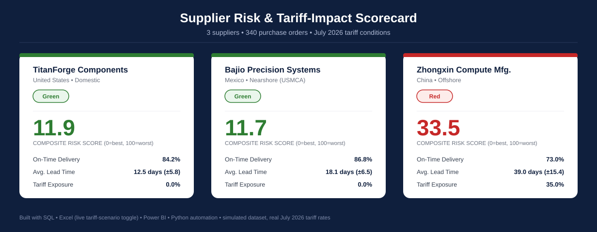
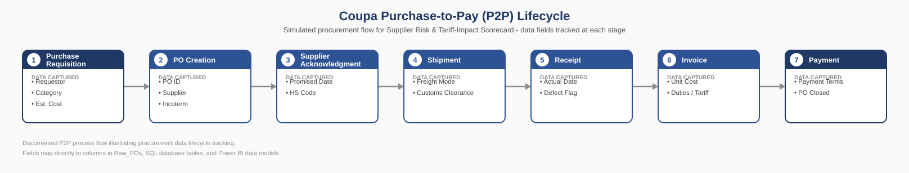

# Supplier Risk & Tariff-Impact Scorecard


An enterprise supplier intelligence, landed-cost modeling, and tariff risk assessment platform designed for supply chain and procurement analytics. Built to answer the critical sourcing question in global supply chains: **which supplier delivers the highest total value once landed costs, tariffs, delivery reliability, and quality are fully accounted for?**



---

## 📌 Executive Summary & Key Sourcing Findings

Comparing suppliers strictly on quoted unit purchase price hides the substantial cost and operational impact of tariffs, shipping delays, and quality fallout. This project models a high-value datacenter infrastructure procurement scenario (GPU servers, network switches, PDU/MEP equipment) across 3 suppliers in 3 distinct geographies.

| Sourcing Metric | TitanForge Components | Bajio Precision Systems | Zhongxin Compute Mfg. |
|:---|:---:|:---:|:---:|
| **Origin & Trade Region** | 🇺🇸 United States (Domestic) | 🇲🇽 Mexico (Nearshore / USMCA) | 🇨🇳 China (Offshore) |
| **Primary Category** | GPU Servers | Network Switches | PDU / MEP Equipment |
| **On-Time Delivery Rate** | 84.2% | **86.8%** 🏆 | 73.0% |
| **Avg Lead Time (± StDev)** | **12.5 days (±5.8)** | 18.1 days (±6.5) | 39.0 days (±15.4) |
| **Effective Tariff Exposure** | **0.0%** | **0.0%** (USMCA Qualified) | **35.0%** (Sec 301 + Sec 122) |
| **Total Landed Spend** | \$15.41M | \$17.24M | \$15.80M |
| **Composite Risk Score (0-100)**| **11.9** 🟢 | **11.7** 🟢 🏆 | **33.5** 🔴 |
| **Risk Classification (RAG)** | 🟢 **Low Risk (Green)** | 🟢 **Low Risk (Green)** | 🔴 **High / Critical (Red)** |

### Sourcing Highlights:
1. **The China Tariff Gap**: While Zhongxin offers the lowest base quoted unit costs, a **35% effective tariff surcharge** adds **\$4.10M in tariff penalties**, inflating landed cost while suffering from high lead-time volatility (±15.4 days) and driving a **33.5 Red Risk Score**.
2. **The Nearshore Winner**: Bajio Precision Systems (Mexico) achieves the highest delivery reliability (**86.8%**), nearshore transit speed, USMCA-preferential 0% tariff exposure, and the lowest composite risk score (**11.7 Green**).
3. **Domestic Benchmark**: TitanForge Components (US) delivers the fastest, most predictable lead time (12.5 days) with zero tariff exposure (**11.9 Green**).

---

## 🏛️ Purchase-to-Pay (P2P) Data Lifecycle

The data pipeline simulates an end-to-end Coupa/ERP procurement workflow capturing audit metrics at every transaction stage:



---

## 📐 Explainable Supplier Risk Scoring Methodology

Rather than relying on an arbitrary black-box rating, the **Composite Risk Score (0–100 scale)** is completely transparent, normalized, and reproducible across Python, SQL, Excel, and Power BI DAX:

$$\text{Composite Risk Score} = 0.30 C_{\text{OT}} + 0.20 C_{\text{LT}} + 0.25 C_{\text{Tariff}} + 0.25 C_{\text{Defect}}$$

### Component Penalties:
- **Delivery Reliability ($C_{\text{OT}}$)**: $(1 - \text{On-Time Delivery Rate}) \times 100$
- **Lead-Time Volatility ($C_{\text{LT}}$)**: $\min\left(\frac{\sigma_{\text{LT}}}{20.0\text{ days}} \times 100, 100\right)$ *(population standard deviation)*
- **Tariff Exposure ($C_{\text{Tariff}}$)**: $\text{Tariff Exposure \%} \times 100$
- **Quality Fallout ($C_{\text{Defect}}$)**: $\text{Defect Rate \%} \times 100$

### RAG Risk Categorization:
- 🟢 **Green (Low Risk)**: Score $< 15.0$
- 🟡 **Yellow (Moderate Risk)**: $15.0 \le \text{Score} < 30.0$
- 🔴 **Red (High / Critical Risk)**: $\text{Score} \ge 30.0$

---

## 🌐 Dynamic Tariff Scenario Modeling

The platform includes a scenario simulation engine modeling trade policy variations:

| Scenario | Foreign Adjustment Type | Adjustment Value | Description | Portfolio Landed Spend | Delta vs Baseline |
|:---|:---:|:---:|:---|:---:|:---:|
| **Current (Jul 2026)** | Additive | $+0.0\%$ | Baseline tariff rates (China 35%, Mexico 0%, US 0%) | **\$48.45M** | Baseline |
| **+10% Escalation** | Additive | $+10.0\%$ | Moderate trade tension escalation | **\$49.62M** | +\$1.17M |
| **+25% Escalation** | Additive | $+25.0\%$ | High trade penalty escalation | **\$51.38M** | +\$2.93M |
| **Section 122 Sunset** | Additive | $-10.0\%$ | Statutory expiration of China Section 122 surcharge | **\$47.28M** | -\$1.17M |
| **Universal 50%** | Absolute | $50.0\%$ | Universal blanket import tariff | **\$54.31M** | +\$5.86M |

---

## 🛠️ Repository Structure

```
Supplier-Risk-and-Tariff-Impact-Scorecard/
├── data/                       # Source CSV datasets (Suppliers, POs, Tariffs, Defects)
│   ├── purchase_orders.csv
│   ├── quality_defects.csv
│   ├── suppliers.csv
│   ├── tariff_reference.csv
│   └── tariff_scenarios.csv
├── src/scorecard/              # Modular, production-grade Python package
│   ├── __init__.py
│   ├── config.py               # Weights, thresholds, and path configurations
│   ├── models.py               # Pydantic schemas for data validation
│   ├── ingestion.py            # Data loading & schema integrity checks
│   ├── cleaning.py             # Deduplication & date/type standardization
│   ├── risk_engine.py          # KPI metrics & explainable risk scoring engine
│   ├── scenario_engine.py      # Multi-scenario tariff simulation engine
│   ├── history_tracker.py      # Snapshot persistence & change detection alerts
│   ├── database.py             # SQLite relational database manager
│   ├── reporting.py            # Power BI dataset exporter & Markdown reporter
│   └── pipeline.py             # End-to-end orchestrator & CLI
├── sql/                        # Relational schema and analytical queries
│   ├── schema.sql              # Relational table DDL
│   ├── diagnostics.sql         # Data quality audit & clean view definition
│   ├── analytics_kpis.sql      # Parity-tested KPI & risk scoring SQL queries
│   └── supplier_scorecard.db   # SQLite database instance
├── excel/                      # Excel deliverable
│   └── Supplier_Risk_Tariff_Scorecard.xlsx # Interactive workbook with live formulas & scenario dropdown
├── powerbi/                    # Power BI deliverables
│   ├── powerbi_ready_export.csv # Flattened, deduplicated export
│   ├── DAX_measures.dax        # Complete production DAX measure library
│   └── DAX_walkthrough.md      # Step-by-step data modeling & dashboard guide
├── automation/                 # Scheduled refresh automation
│   └── monthly_scorecard_refresh.py # Automated monthly recomputation & RAG alert diffing
├── scripts/                    # Programmatic generation & build scripts
│   ├── generate_dataset.py     # Deterministic dataset simulator
│   ├── build_database.py       # SQLite database builder
│   ├── build_excel.py          # Openpyxl workbook builder
│   ├── build_diagram.py        # P2P lifecycle SVG diagram generator
│   └── build_hero_preview.py   # Hero scorecard preview SVG generator
├── docs/                       # Technical documentation
│   ├── ARCHITECTURE.md         # Full system architecture and component flows
│   ├── DATA_MODEL.md           # Entity-relationship diagrams & data dictionary
│   ├── METHODOLOGY.md          # Mathematical formulas and derivations
│   ├── EXECUTION_GUIDE.md      # Clean-room reproduction instructions
│   └── INTERVIEW_PREP.md       # Technical walkthrough & interview defense
├── tests/                      # Automated Pytest suite
│   ├── conftest.py             # Shared fixtures and mock datasets
│   ├── test_data_validation.py # Schema and ingestion validation tests
│   ├── test_risk_engine.py     # Risk scoring and edge case tests
│   ├── test_scenario_engine.py # Tariff simulation tests
│   ├── test_history_tracker.py # Historical diffing and alert tests
│   ├── test_sql_reconciliation.py # SQL vs Python mathematical parity tests
│   └── test_pipeline_integration.py # Full pipeline execution tests
├── requirements.txt            # Python dependencies
├── pytest.ini                  # Pytest configuration
└── README.md                   # Project overview & documentation
```

---

## 🚀 Quickstart & Execution Guide

### 1. Environment Setup
```bash
python -m venv venv
# On Windows:
.\venv\Scripts\Activate.ps1
# On Linux/macOS:
source venv/bin/activate

pip install -r requirements.txt
```

### 2. Run the End-to-End Pipeline
```bash
python -m scorecard.pipeline --data-dir data --output-dir output
```

### 3. Run Automated Monthly Refresh
```bash
python automation/monthly_scorecard_refresh.py --data-dir data --output-dir output --snapshot-tag 2026-07
```

### 4. Run Pytest Suite
```bash
pytest -v
```

---

## 🎯 Resume & Portfolio Summary

*"Architected and engineered an end-to-end Supplier Risk & Tariff-Impact Scorecard platform for high-value datacenter infrastructure procurement across 3 suppliers and 340+ purchase orders. Built a modular Python pipeline (`pydantic`, `pandas`, `openpyxl`, `pytest`), an SQLite diagnostic layer with clean views, an interactive Excel workbook with live dynamic formulas and scenario dropdowns, and a Power BI data model with DAX measures—quantifying \$4.1M in tariff exposure and identifying a 3x risk gap between domestic/nearshore and offshore sourcing partners."*
